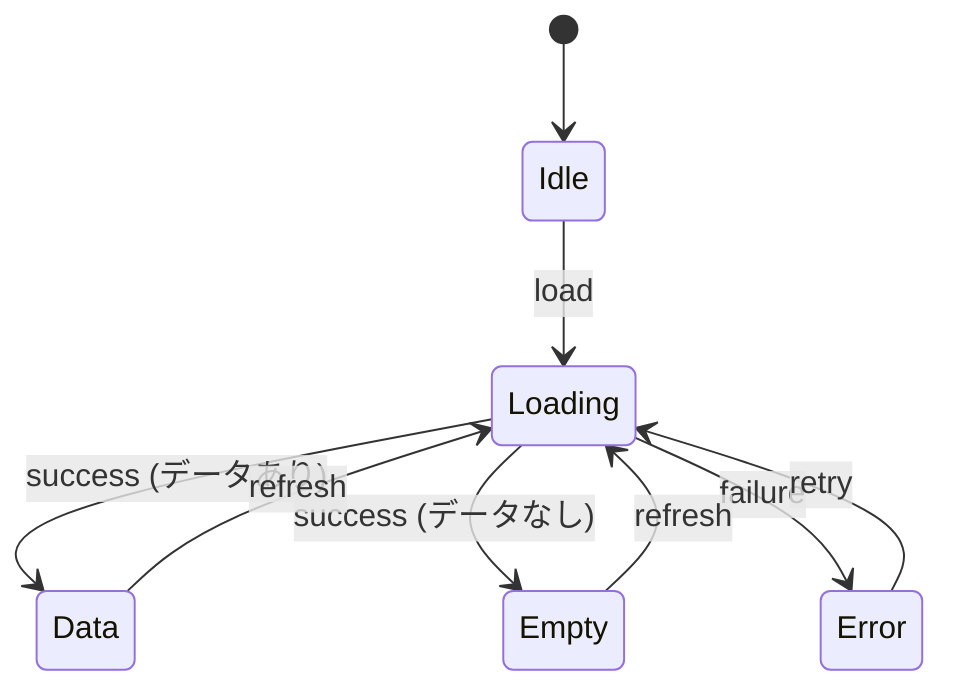

# SPEC セクション詳細ガイド

## PATH CONTRACT (MANDATORY)

> **BINDING**: 本ドキュメントのすべてのパス例は動的プレースホルダーを使用する。
> AI は SPEC 生成時に必ず `project-config.json` からパスを解決しなければならない。

| Placeholder | Resolution Source | Default |
|-------------|-------------------|---------|
| `{FEATURES_DIR}` | project-config.paths.features | `src/features` |
| `{TESTS_DIR}` | project-config.paths.tests_unit | `tests/unit` |
| `{DOCS_DIR}` | project-config.paths.docs_features | `docs/features` |
| `{COMPONENT_EXT}` | project-config.conventions.component_extension | `.tsx` |

**FORBIDDEN**: SPEC 生成時にリテラル `src/features/` の使用は禁止。必ず `{FEATURES_DIR}/` を使用する。

---

> 対象プロジェクトの Feature-First + Simplified Clean Architecture に最適化された SPEC 作成ガイド（project-config.json の framework/language を参照）
>
> 過度な抽象化（DDD/CQRS/イベントソーシング等）を排除し、プロジェクトの技術スタックに適応するよう簡素化されている。

---

## 核心原則: Zero-Context AI 開発可能性

> **目標**: AI が SPEC ドキュメントのみで実装を開始できること（コード探索を最小化）

本ガイドのすべてのセクションは、以下の質問に "Yes" と答えられるよう設計されている:

- AI がファイルをどこに生成すべきか、推測なしに判断できるか?
- AI がネーミング規則を推測なしに従えるか?
- AI がドメイン用語を正確に理解できるか?
- AI がデータスキーマを推測なしに実装できるか?
- AI が API リクエスト/レスポンス形式を正確に把握できるか?
- AI がエラー処理方法を明確に把握できるか?
- AI が性能/セキュリティ要件を満たせるか?
- AI がビジネスロジックを pseudocode で理解できるか?
- AI がテストデータを fixture として再利用できるか?
- AI がメッセージキー名を規則通りに生成できるか?

---

## Characteristic ベースの SPEC 深さ調整

> **課題**: Full SPEC v3.0 は全セクションが詳細で作成コストが高い
> **解決策**: CONTEXT.json の characteristics に応じて必須の深さを差別化して適用

### 深さ判定基準

| 深さ | 条件（いずれか true） |
|------|---------------------|
| **Full**（旧 Tier 1） | security_sensitive, payment_billing, pii_handling |
| **Standard**（旧 Tier 2） | involves_external_api, multi_screen, db_schema_change |
| **Lite**（旧 Tier 3） | 上記に該当しない |

### 深さ別必須セクション (v3.6 簡素化)

| セクション                             |  Full  | Standard |  Lite  |
| -------------------------------- | :-------------: | :---------------: | :-------------: |
| **§0.0 Project Context**         |     ✅ 詳細     |      ✅ 簡略      |     📝 1行      |
| §0.1 Target Files                |     ✅ 詳細     |      ✅ 詳細      |     ✅ 簡略     |
| **§0.2.1 Core State**            |  ✅ 全体テーブル |   ✅ 全体テーブル  |     ✅ 簡略     |
| **§0.2.2 Architecture Guidance** |  ✅ 基準+例   |    ✅ 基準のみ      | 📝 "単一 Hook"  |
| **§0.2.3 State Transitions**     | ✅ 遷移テーブル  |  ✅ 遷移テーブル   |   📝 テキスト     |
| §0.3 Error Handling              |     ✅ 全体     |    ✅ テーブル      |   📝 テキスト     |
| §0.4.1 Zod スキーマ                |     ✅ 全体     |      ✅ 全体      |  📝 または N/A    |
| §0.4.2 DB スキーマ                 |     ✅ 全体     |      ✅ 全体      |  📝 または N/A    |
| **§0.5 API Contract**            |     ✅ 全体     |      ✅ 全体      |  📝 または N/A    |
| **§0.6 NFR**                     |     ✅ 詳細     |     ✅ 標準値     | 📝 "一般 CRUD"  |
| §0.7 AI Logic & Prompts          |   ✅ (AI 時)    |    ✅ (AI 時)     |    N/A 許容     |
| §0.8 Safety & Guardrails         |   ✅ (AI 時)    |    ✅ (AI 時)     |    N/A 許容     |
| **§0.9 Design Tokens**           |     ✅ 詳細     |      ✅ 簡略      |  📝 "既存を使用" |
| §1 概要                          |       ✅        |        ✅         |       ✅        |
| **§1.5 Screen Flow**             | ✅ ダイアグラム   |    ✅ テーブル      |   📝 テキスト     |
| §2 FR                            |   ✅ BDD 5列    |    ✅ BDD 5列     |   ✅ BDD 簡略   |
| **§2.X Business Rules**          |  ✅ Pseudocode  |    ✅ テキスト      |     📝 簡略     |
| §3 依存関係/リスク                 |    ✅ Top 3     |     ✅ Top 3      |     📝 1行      |
| §4 画面ドキュメント                     |     ✅ 詳細     |      ✅ 簡略      |  📝 スキップ可   |
| **§5 検証 & テスト**             | ✅ シナリオ一覧 |      ✅ 簡略     |  📝 スキップ可   |
| **§6 メッセージ定義**               |     ✅ 詳細     |      ✅ 簡略      | 📝 キー一覧のみ    |
| §7 変更履歴                     |       ✅        |        ✅         |       ✅        |

**凡例**: ✅ 必須, 📝 簡略/テキスト許容

### SPEC-Lite 例

```markdown
# 029: データ入力 UI 改善

> **状態**: 進行中 (30%) | **優先度**: P2 | **更新日**: 2026-02-11
> **SPEC バージョン**: v3.5 Lite

---

## 0. AI 実装契約

### 0.0 Project Context

既存 data-input モジュールの拡張、新規ファイルなし

### 0.1 Target Files

| レイヤー | 範囲 (Glob)                             | 作業 | 条件 |
| ------ | --------------------------------------- | :--: | ---- |
| UI     | `{FEATURES_DIR}/data-input/components/**` |  🔄  | -    |

### 0.2 State & Architecture

既存の `useDataInput` Hook を再利用、UI レイヤーのみ変更（単一 Hook を維持）

### 0.3 Error Handling

既存パターンを維持

### 0.4-0.8

**N/A** - 既存実装を再利用

### 0.9 Design Tokens

既存テーマを使用

---

## 1. 概要

目標: データ入力領域の可読性向上（書式サポートの追加）

---

## 2. 機能要求事項

### FR-02901: 書式サポート

| AC  | Given          | When         | Then                   | 観測点                      |
| :-: | -------------- | ------------ | ---------------------- | --------------------------- |
| AC1 | データ入力状態 | 書式タイプ変更 | 対応する書式を適用     | `format === 'structured'`   |

---

## 6. i18n

- `code_input_language_label`: "言語"
- `code_input_language_typescript`: "TypeScript"

---

## 7. 変更履歴

| 日付       | バージョン   | 変更   |
| ---------- | ------ | ------ |
| 2026-02-11 | v1.0   | 初稿   |
```

### いつ SPEC-Lite を使うか?

| 状況                   | 推奨                        |
| ---------------------- | --------------------------- |
| 新規機能、API を含む    | **Full SPEC v3.5**          |
| 既存機能の拡張、API 変更 | **Standard**              |
| UI 改善、バグ修正     | **SPEC-Lite** 許容          |

> **注意**: 深さの判断を誤ると AI 実装品質が低下する。不確実な場合は **上位の深さ** を選択すること。

---

## セクション 0: AI 実装契約（必須）

> **目的**: AI が実装開始前に把握すべき核心情報を一目で提供
> **原則**: コードから抽出可能な情報でも SPEC に要約し、AI のコンテキスト収集コストを削減

---

### 0.0 Project Context (v3.0 新規)

> **目的**: AI がネーミング、用語を推測なしに判断できるように
> **ファイル配置**: AI が既存コードベースのパターンを参照して自律的に決定

#### 0.0.1 Naming Conventions

```markdown
#### 0.0.2 Naming Conventions

| 対象           | パターン                             | 例                             |
| -------------- | -------------------------------- | -------------------------------- |
| Custom Hook    | `use{Feature}`                   | `useDataInput`                   |
| State 型     | `{Feature}State`                 | `DataInputState`                 |
| 型定義      | `{Entity}` または `{Entity}Type`  | `DataSubmission`                 |
| イベント         | `on{Action}`                     | `onSubmitData`, `onProcess`      |
| メッセージキー      | `{screen}_{element}_{state}`     | `data_input_submit_button_label` |
| コンポーネント       | `{Feature}{Role}` (PascalCase)   | `DataInputPanel`, `ReportOption`   |
| API Route      | `/api/{feature}/{action}`        | `{SOURCE_ROOT}/api/{feature}/{action}`（フレームワーク別パス） |
```

**作成原則**:

- コードベースの既存コンベンションと一致すること
- AI がネーミングを推測しないよう、具体的な例を含める

#### 0.0.2 Glossary

```markdown
#### 0.0.2 Glossary

> **参照**: [docs/glossary.md](../glossary.md) - プロジェクト全体の用語集
> この機能で使用するドメイン用語は glossary.md を参照

**この機能関連の核心用語**:

| 用語    | 定義   | コード表現     |
| ------- | ------ | ------------- |
| {Term1} | {定義} | `{TypeName}`  |
| {Term2} | {定義} | `{fieldName}` |

> ℹ️ 用語の追加が必要な場合は glossary.md に先に登録してから参照する
```

**作成原則**:

- **SSOT**: `docs/glossary.md` が真実の源泉
- SPEC ではこの機能で使用する核心用語のみを抜粋
- 新しい用語は glossary.md に先に登録

---

### 0.1 Target Files（範囲ベース）

> **v3.1 変更**: 具体的なファイルパスの代わりに **Glob パターン** を使用
> **SSOT**: CONTEXT.json の `references.related_code` が実際のファイル一覧を管理

```markdown
| レイヤー    | 範囲 (Glob)                             | 作業 | 条件          | 備考                         |
| --------- | --------------------------------------- | :--: | ------------- | ---------------------------- |
| 型定義 | `{FEATURES_DIR}/code-input/types/**`      |  🆕  | -             | Zod スキーマ + TypeScript 型 |
| Hook      | `{FEATURES_DIR}/code-input/hooks/**`      |  🆕  | -             | カスタム Hook（状態管理）      |
| API       | `{FEATURES_DIR}/code-input/api/**`        |  🆕  | -             | API 呼び出し                     |
| UI        | `{FEATURES_DIR}/code-input/components/**` |  🆕  | -             | React コンポーネント               |
| Test      | `tests/unit/features/code-input/**`     |  🆕  | -             | 単体テスト                  |
| API Route | `{SOURCE_ROOT}/api/{feature}/**`（フレームワークによる） |  🆕  | AI 分析選択時 | 条件付き                     |
```

**作業タイプ**:
| アイコン | 意味 |
|:------:|------|
| 🆕 | 新規作成 |
| 🔄 | 既存修正 |
| ⚡ | 条件付き（条件列を参照） |

**作成原則**:

- Glob パターンで範囲を指定（`**`, `*` を使用）
- **条件付きファイル** は条件列にトリガー条件を明示
- 具体的なファイル一覧は CONTEXT.json の `references.related_code` を参照
- 実装後の CONTEXT.json 更新が SSOT 維持の要

**例: 条件付きファイルの処理**:

```markdown
| レイヤー    | 範囲                             | 作業 | 条件            | 備考         |
| --------- | -------------------------------- | :--: | --------------- | ------------ |
| API Route | `{SOURCE_ROOT}/api/{feature}/**`（フレームワークによる） |  ⚡  | Option A 選択時 | サーバー分析    |
| Client    | `{FEATURES_DIR}/code-input/lib/**` |  ⚡  | Option B 選択時 | ローカル処理    |
```

→ ユーザーが Option A を選択した場合、API Route のみ実装

#### §0.1 ↔ §0.4 相互参照検証 (v3.7 新規)

> **目的**: Data Schema（§0.4）で定義した項目が Target Files（§0.1）に漏れなく反映されることを保証
> **検証時点**: SPEC 作成完了後の Phase 4 検証段階

| §0.4 で定義             | §0.1 に必須反映     | 検証ルール                                  |
| ------------------------ | -------------------- | ------------------------------------------ |
| §0.4.1 新規 Zod スキーマ   | `型定義` レイヤー   | スキーマ定義時にファイルパス必須              |
| §0.5 新規 API Route      | `API Route` レイヤー   | エンドポイント定義時にルートディレクトリ必須    |

**漏れ防止チェックリスト**:

- [ ] §0.4.1 で `AnalysisResultSchema` のような新規スキーマ定義 → §0.1 に `{FEATURES_DIR}/{domain}/types/{schema}.ts` を追加
- [ ] §0.5 で新規 API Route 定義 → §0.1 に `{SOURCE_ROOT}/api/{name}/`（フレームワーク別パス）を追加

**よくある漏れパターン**:

```markdown
❌ 誤った例（型定義レイヤーの漏れ）:
| レイヤー | 範囲 | 作業 |
|---------|------|:----:|
| Hook | `{FEATURES_DIR}/analysis/hooks/**` | 🆕 | ← Hook のみ
| UI | `{FEATURES_DIR}/analysis/components/**` | 🆕 | ← 型定義レイヤーなし!

§0.4.1 で AnalysisResultSchema 定義 → 型定義レイヤー必須!

✅ 正しい例:
| レイヤー | 範囲 | 作業 |
|---------|------|:----:|
| 型定義 | `{FEATURES_DIR}/analysis/types/**` | 🆕 | ← 追加
| Hook | `{FEATURES_DIR}/analysis/hooks/**` | 🆕 |
| UI | `{FEATURES_DIR}/analysis/components/**` | 🆕 |
```

---

### 0.2 State & Architecture (v3.5 改編)

> **v3.5 変更**: 処方的 Provider リスト → **原則ベースのガイドライン** に転換
> **目的**: AI が機能の複雑度に合わせて自律的に設計しつつ、一貫したパターンに従うように

---

#### 0.2.1 Core State（必須）

> **目的**: AI が管理すべき **核心状態要素** を定義
> **原則**: 状態構造は明示するが、実装ファイル数は AI が SRP 基準で決定

````markdown
#### 0.2.1 Core State

##### 状態要素の定義

| 状態要素 | 型                 | 必須 | 用途                                     | 初期値   |
| --------- | -------------------- | :--: | ---------------------------------------- | -------- |
| `items`   | `CodeSubmission[]`   |  ✅  | データ一覧                              | `[]`     |
| `status`  | `ScreenStatus`       |  ✅  | 画面状態（idle/loading/data/empty/error） | `'idle'` |
| `error`   | `AppError \| null`   |  ⚪  | エラー情報                                | `null`   |
| `filter`  | `CodeFilter \| null` |  ⚪  | フィルタ条件                                | `null`   |

##### 状態 enum 定義（推奨）

```typescript
type ScreenStatus = 'idle' | 'loading' | 'data' | 'empty' | 'error';
```
````

##### 派生状態 (Derived State)

| 派生状態       | 計算式                                        | 用途                   |
| --------------- | --------------------------------------------- | ---------------------- |
| `hasData`       | `status === 'data' && items.length > 0`       | データ表示条件       |
| `filteredItems` | `filter ? applyFilter(items, filter) : items` | フィルタ済み一覧          |
| `itemCount`     | `filteredItems.length`                        | UI 表示用              |

````

**Core State 作成原則**:
- **核心状態要素** のみ定義（実装詳細ではない）
- 派生状態は Hook の `useMemo` で実装
- 状態要素の **初期値** を明示し、AI がテスト作成時に活用

---

#### 0.2.2 Architecture Guidance（ガイドライン）

> **目的**: AI が **SRP（単一責任原則）** に従って自律的にファイルを分離できるよう案内
> **核心**: 具体的なファイルリストの代わりに **分離基準** と **ネーミング規則** を提供

```markdown
#### 0.2.2 Architecture Guidance

##### Hook 分離基準 (SRP 原則)

| 条件 | 推奨行動 | 例 |
|------|---------|------|
| 画面 1 個、単純 CRUD | 単一 Hook | `useCodeInput` |
| 画面 2 個+（一覧/詳細） | 画面別 Hook 分離 | `useCodeList`, `useCodeDetail` |
| 複雑なフォーム検証 | 別途 Form Hook | `useCodeForm` |
| 複数画面で状態共有 | Context + Hook | `CodeInputProvider` + `useCodeInputContext` |

##### API 分離基準

| 条件 | 推奨行動 | 例 |
|------|---------|------|
| 単純な API 呼び出し | API 関数 1 個 | `processData()` |
| 外部 API 連携（AI 等） | 外部 API 別に分離 | `processData()`, `generateReport()` |
| 複雑なビジネスロジック | ドメインサービス分離 | `analysisService` |

##### ネーミング規則（必須遵守）

| 対象 | パターン | 例 |
|------|---------|------|
| **Hook（一覧）** | `use{Feature}List` | `useCodeList` |
| **Hook（詳細）** | `use{Feature}Detail` | `useCodeDetail` |
| **Hook（フォーム）** | `use{Feature}Form` | `useCodeForm` |
| **Hook（単一）** | `use{Feature}` | `useCodeInput` |
| **API 関数** | `{action}{Feature}` | `processData`, `fetchDetail` |
| **型定義** | `{Feature}State` | `CodeInputState` |
| **コンポーネント** | `{Feature}{Role}` | `CodeInputPanel`, `CodeInputForm` |

##### React ライフサイクルガイドライン

| 状況 | パターン | 理由 |
|------|---------|------|
| 画面別状態（基本） | `useState` / `useReducer` | メモリ節約、コンポーネントアンマウント時に解放 |
| アプリ全体状態（テーマ等） | `Context` + `useContext` | アプリ終了まで維持 |
| サーバー状態（API データ） | `fetch` + `useState` / SWR | キャッシュ管理 |
| 高コスト計算 | `useMemo` | 再計算防止 |

##### AI 設計決定フロー

````

1. FR（機能要求事項）分析
   ↓
2. 画面数の把握（Screen Flow 参照）
   ↓
3. Hook 分離要否の決定
   ├── 画面 1 個 + 単純 → 単一 Hook
   └── 画面 2 個+ または複雑 → 分離
   ↓
4. API 分離要否の決定
   ├── 単純 API → 単一関数
   └── 外部 API/複雑ロジック → 分離
   ↓
5. ネーミング規則の適用
   ↓
6. ライフサイクル決定 (useState/useContext/useMemo)

```

```

**Architecture Guidance 作成原則**:

- **分離基準** を明確にし、AI が一貫した判断を下せるように
- **ネーミング規則** は必須遵守（一貫性の保証）
- **「例」セクションは任意** - 複雑な機能でのみ追加
- 深さ別に異なる適用:
  - Lite（単純）: 分離基準のみ参照、大半は単一 Hook
  - Full/Standard（複雑）: 分離基準 + 具体的な例を推奨

##### 深さ別 §0.2.2 作成ガイド

| 項目           |  Full  | Standard |   Lite    |
| -------------- | :-------------: | :---------------: | :----------------: |
| Core State     |  ✅ 全体テーブル |   ✅ 全体テーブル  |  ✅ 簡略テーブル    |
| 分離基準の参照 | ✅ + 具体的な例 |    ✅ 基準のみ      |   📝 "単一 Hook"   |
| ネーミング規則    |     ✅ 全体     |      ✅ 全体      |      ✅ 全体       |
| ライフサイクル   |     ✅ 詳細     |      ✅ 基本      | 📝 "useState 基本" |

---

### 0.2.3 State Transitions（簡素化）

> **目的**: AI が状態遷移を正確に理解できるよう核心情報のみ提供

````markdown
#### 0.2.3 State Transitions

##### 状態一覧

| 状態      | 説明           |
| --------- | -------------- |
| `idle`    | 初期状態      |
| `loading` | データロード中 |
| `data`    | データ表示中 |
| `empty`   | データなし    |
| `error`   | エラー発生      |

##### 遷移テーブル

| From      | Event                  | To        | 備考           |
| --------- | ---------------------- | --------- | -------------- |
| `idle`    | `load`                 | `loading` | 画面進入時   |
| `loading` | `success（データあり）` | `data`   | -              |
| `loading` | `success（データなし）` | `empty`  | -              |
| `loading` | `failure`              | `error`   | エラーログ記録      |
| `data`    | `refresh`              | `loading` | -              |
| `error`   | `retry`                | `loading` | 最大 3 回       |

##### 状態ダイアグラム (Mermaid)


````

````

**作成原則**:
- 状態一覧と遷移テーブルのみ必須
- 複雑な場合のみ Mermaid ダイアグラムを追加
- コードパターンは AI が既存コードベースを参照

---

### 0.3 Error Handling Policy（拡張）

> **v3.0 拡張**: 4 個の下位セクションに細分化

#### 0.3.1 Error Classification

```markdown
| エラータイプ   | コード範囲      | リトライ可否 | ログ必須 |
|------------|---------------|:------------:|:--------:|
| Validation | `VALIDATION_*` | ❌ | ❌ |
| Network    | `NETWORK_*`    | ✅ | ✅ |
| Auth       | `AUTH_*`       | 条件付き | ✅ |
| Business   | `BIZ_*`        | ❌ | ⭕ |
| System     | `SYSTEM_*`     | ✅ | ✅ |
````

#### 0.3.2 User-Facing Messages

```markdown
| エラーコード             | ユーザーメッセージ (ja)               | メッセージキー                   |
| --------------------- | -------------------------------- | --------------------------- |
| `NETWORK_OFFLINE`     | "ネットワークに接続してください"       | `error_network_offline`     |
| `VALIDATION_REQUIRED` | "{field}を入力してください"    | `error_validation_required` |
| `AUTH_EXPIRED`        | "再度ログインしてください"           | `error_auth_expired`        |
```

#### 0.3.3 Recovery Actions

```markdown
| エラータイプ   |     自動復旧     | ユーザーアクション    | UI 表示       |
| ----------- | :---------------: | -------------- | ------------- |
| Network     |   3 回リトライ    | リトライボタン  | Toast + Retry |
| Auth        | トークン更新を試行    | 再ログイン       | Dialog        |
| Validation  |        -          | フィールド修正      | Inline error  |
| Business    |        -          | 案内確認      | Dialog        |
```

#### 0.3.4 Logging Requirements

```markdown
| エラータイプ   | ログレベル | 含める情報                     | サンプリング |
| ----------- | --------- | ----------------------------- | ------ |
| Network     | WARN      | `url`, `status`, `duration`   | 100%   |
| Auth        | ERROR     | `user_id`, `action`, `reason` | 100%   |
| Business    | INFO      | `action`, `params`            | 10%    |
| System      | ERROR     | `stack_trace`, `context`      | 100%   |
```

**Fail-Fast 原則**:

- 不正な入力は即座に検証して失敗処理する
- Silent failure 禁止（`catch (e) {}` 禁止）
- すべてのエラーは logger で記録する

---

### 0.4 Data Schema & Security（必須）

> **v3.0**: Zod スキーマだけでなく **API スキーマ** も必須記載
> **SSOT**: `{FEATURES_DIR}/{feature}/types/` が真実の源泉、SPEC は要約 + 意図の記録

#### 0.4.1 Zod スキーマ（フロントエンド側）

```markdown
| スキーマ                 | フィールド/型                             | nullable | 備考               |
| ---------------------- | ------------------------------------- | :------: | ------------------ |
| `CodeSubmissionSchema` | `id: z.string()`                      |    ❌    | UUID               |
|                        | `code: z.string()`                    |    ❌    | 提出コード          |
|                        | `language: z.string()`                |    ❌    | プログラミング言語    |
|                        | `errorMessage: z.string().optional()` |    ⭕    | エラーメッセージ        |
|                        | `goal: z.string().optional()`         |    ⭕    | 学習目標          |
|                        | `createdAt: z.string().datetime()`    |    ❌    |                    |
```

**Zod スキーマ規則**:

- `z.object()` でスキーマを定義
- `z.infer<typeof Schema>` で TypeScript 型を導出
- バリデーションメッセージは日本語で定義

##### 0.4.1.1 Model Invariants (v3.3 新規)

> **目的**: モデルレベルで絶対に破られてはならない規則を定義
> **検証時点**: Zod parse、ファクトリ関数、状態更新時

````markdown
#### Model Invariants

| Model            |  INV-ID  | 不変条件                     | 検証方法                  | 違反時    |
| ---------------- | :------: | ----------------------------- | -------------------------- | ---------- |
| `CodeSubmission` | M-INV-01 | `code` は空文字列不可       | `z.string().min(1)`        | `ZodError` |
| `CodeSubmission` | M-INV-02 | `language` はサポート言語のみ      | `z.enum([...])`            | `ZodError` |
| `ReportFilter`   | M-INV-03 | `selectedIndex` >= 0          | `z.number().nonnegative()` | `ZodError` |

**不変条件の実装パターン**:

```typescript
import { z } from 'zod';

/** コード提出スキーマ - 不変条件を Zod で保証 */
export const CodeSubmissionSchema = z.object({
  id: z.string().uuid(),
  // M-INV-01: code は空文字列不可
  code: z.string().min(1, 'コードを入力してください'),
  // M-INV-02: language はサポート言語のみ
  language: z.enum(['typescript', 'javascript', 'python', 'java']),
  errorMessage: z.string().optional(),
  goal: z.string().optional(),
  createdAt: z.string().datetime(),
});

export type CodeSubmission = z.infer<typeof CodeSubmissionSchema>;
```
````

````

**Model Invariants 作成原則**:
- すべての **ビジネス上の核心制約** を不変条件として文書化
- 検証失敗時の動作（例外 vs 自動補正）を明示
- **Zod スキーマで検証**（ランタイム保証）

---

### 0.5 API Contract（必須） - Hybrid v3.1

> **v3.1 更新**: ハイブリッド方式（Schema テーブル + Example JSON）を導入
> **SSOT 原則**: コードの `route.ts` > Schema テーブル > Example JSON
> **検証**: `spec-validator` が Example ↔ Schema の一致を自動検証

#### API 使用有無の判断

| 状況 | 処理 |
|------|------|
| API Route **なし** | `§0.5: N/A - クライアント処理のみ` を明示 |
| エンドポイント **1-2 個** | §0.5 にハイブリッド形式で記載 |
| エンドポイント **3 個+** または **100 行+** | 別途 `API-{NNN}.md` に分離 |

#### §0.5 ハイブリッド形式 (v3.1)

```markdown
### 0.5 API Contract

> **SSOT**: `{SOURCE_ROOT} の API ルート（フレームワークによる）`

#### エンドポイント一覧

| ID | Method | Path | Auth | Idempotent | Description |
|----|--------|------|:----:|:----------:|-------------|
| API-001-01 | POST | `{SOURCE_ROOT}/api/{feature}/process` | ❌ | ❌ | データ処理 |

#### API-001-01: process

##### Request Schema (SSOT)

| Field | Type | Required | Constraints | Description | Example |
|-------|------|:--------:|-------------|-------------|---------|
| `data` | string | ✅ | minLength: 1, maxLength: 10000 | 処理対象データ | `"{ \"name\": \"test\" }"` |
| `category` | string | ✅ | enum: プロジェクト別に定義 | カテゴリ | `"report"` |
| `errorMessage` | string | ⚪ | maxLength: 2000 | エラーメッセージ | `"TypeError..."` |
| `goal` | string | ⚪ | maxLength: 500 | 処理目標 | `"データ正規化"` |

##### Request Example

```json
{
  "data": "{ \"name\": \"test\", \"value\": 42 }",
  "category": "report",
  "goal": "データを正規化する"
}
````

##### Response Schema (SSOT)

| Field              | Type   | Required | Constraints         | Description      | Example              |
| ------------------ | ------ | :------: | ------------------- | ---------------- | -------------------- |
| `status`           | string |    ✅    | enum: `ok`, `error` | 処理結果        | `"ok"`               |
| `data`             | object |    ⚪    | -                   | 成功時の結果     | `{}`                 |
| `data.summary`     | string |    ⚪    | -                   | 処理サマリー        | `"正規化完了..."`   |
| `data.comparison`  | object |    ⚪    | -                   | 変更比較        | `{}`                 |
| `error`            | object |    ⚪    | status=error 時     | エラー情報        | `{}`                 |
| `error.code`       | string |    ⚪    | UPPER_SNAKE_CASE    | エラーコード        | `"INVALID_INPUT"`    |
| `error.message`    | string |    ⚪    | -                   | エラーメッセージ      | `"データは必須です"` |

##### Success Response Example (200 OK)

```json
{
  "status": "ok",
  "data": {
    "summary": "入力データを正規化して...",
    "comparison": {
      "before": "{ \"name\": \"test\", \"value\": 42 }",
      "after": "{ \"name\": \"test\", \"value\": 42, \"normalized\": true }"
    }
  }
}
```

##### Error Codes

| HTTP | Code             | Condition          | User Message (ja)              | Client Action            |
| :--: | ---------------- | ------------------ | ------------------------------ | ------------------------ |
| 400  | `INVALID_INPUT`  | 必須フィールド欠落     | "入力内容を確認してください"    | Inline エラー表示         |
| 429  | `RATE_LIMITED`   | リクエスト過多          | "しばらくしてから再度お試しください"   | 指数バックオフ後リトライ  |
| 500  | `INTERNAL_ERROR` | サーバーエラー          | "エラーが発生しました"          | リトライ（最大 2 回）      |

````

#### ハイブリッド形式 作成原則

| 要素 | 必須 | 役割 | 検証方法 |
|------|:----:|------|---------|
| **Schema テーブル** | ✅ | 型/制約条件の定義 (SSOT) | spec-validator |
| **Request Example** | ✅ | 実際のリクエスト形態 | Schema との一致検証 |
| **Response Example** | ✅ | 実際のレスポンス形態 | Schema との一致検証 |
| **Error Codes テーブル** | ✅ | エラー一覧 + 対応 | - |
| **Error Examples** | ✅ | エラーレスポンス形態 | Error Codes との一致検証 |

---

### 0.6 NFR (Non-Functional Requirements) - 必須

> **目的**: AI が品質基準を満たす実装ができるよう明確な目標を提示

```markdown
### 0.6 NFR（非機能要求事項）

#### パフォーマンス (Performance)

| 指標 | 目標 | 測定方法 |
|------|------|---------|
| **初回応答時間** | < 500ms | API 呼び出し開始 → 最初のバイト受信 |
| **全体応答時間** | < 2s (P95) | API 呼び出し開始 → 完了 |
| **ストリーミング開始** | < 1s | （ストリーミング API のみ）最初のチャンク受信 |

#### 同時実行性 (Concurrency)

| 項目 | 想定値 | 備考 |
|------|--------|------|
| **同時ユーザー数** | ~100 人 | MVP 基準 |
| **ユーザーあたりリクエスト頻度** | 1 回/10 秒 | 平均 |
| **ピーク倍率** | 3x | ピーク時 300 同時リクエスト |

#### 信頼性 (Reliability)

| 項目 | ポリシー | 備考 |
|------|---------|------|
| **リトライ** | 最大 2 回、指数バックオフ | Network/5xx のみ |
| **タイムアウト** | 30 秒 | クライアント側 |

#### コスト (Cost) - AI 使用機能のみ

| 項目 | 上限 | 備考 |
|------|------|------|
| **LLM 呼び出し回数** | 10 回/ユーザー/日 | 無料プラン |
| **トークン上限** | 入力 2K、出力 1K | リクエストあたり |
| **月間コスト上限** | $100 | 全ユーザー合計 |

#### 可観測性 (Observability)

| 項目 | 内容 |
|------|------|
| **ログ項目** | `user_id`, `action`, `duration_ms`, `status` |
| **メトリクス** | `analysis_total`, `analysis_duration_seconds` |
| **通知条件** | エラー率 > 5%（5 分間）、P95 > 3s |
````

**NFR 作成原則**:

- すべての数値は **測定可能** であること
- AI 使用機能は **コスト上限** 必須
- 該当しない項目は "N/A" を明示（空セクション禁止）

---

### 0.7 AI Logic & Prompts (AI 機能必須)

> **目的**: AI が AI 機能を実装する際、プロンプトと動作を正確に再現できるように

```markdown
### 0.7 AI Logic & Prompts

> ⚠️ **AI 機能必須セクション** - LLM/GenAI を使用しない機能は "N/A" を明示

#### 0.7.1 AI 役割定義

| 役割          | 責任                     | 使用モデル | トークン上限         |
| ------------- | ------------------------ | --------- | ----------------- |
| **Analyzer**  | データ分析、問題点抽出 | LLM API   | 入力 2K、出力 1K  |
| **Explainer** | 詳細分析の生成           | LLM API   | 入力 2K、出力 2K  |
| **ReportMaker** | 要約レポート生成       | LLM API   | 入力 1K、出力 512 |

#### 0.7.2 System Prompt テンプレート

> SSOT: `{SOURCE_ROOT}/config/ai-config.ts` または API Route 内（プロジェクトの AI サービスによる）

**Analyzer Prompt**:
```

You are a programming education assistant.
Analyze the submitted code and provide educational feedback.

## Context

- Language: {{language}}
- User Goal: {{goal}}
- Error (if any): {{errorMessage}}

## Analysis Rules

1. Identify key concepts demonstrated in the code
2. Find potential improvements with educational explanations
3. If there's an error, explain why it occurs and how to fix it

## Output Format (JSON only)

{ "concepts": [...], "improvements": [...], "errorAnalysis": {...} }

````

#### 0.7.3 Response Schema (Structured Output)

> **必須**: LLM レスポンススキーマで強制（プロジェクトの AI サービス API に合わせたレスポンススキーマ検証）、自由テキスト応答は禁止

**Analyzer Response**:
```json
{
  "type": "object",
  "required": ["concepts", "improvements"],
  "properties": {
    "concepts": { "type": "array", "items": { "type": "string" } },
    "improvements": { "type": "array", "items": { "type": "object" } },
    "errorAnalysis": { "type": "object" }
  }
}
````

#### 0.7.4 Prompt 変数注入

| 変数               | ソース            | 型   | 必須 |
| ------------------ | --------------- | ------ | :--: |
| `{{language}}`     | リクエスト body       | string |  ✅  |
| `{{goal}}`         | リクエスト body       | string |  ⚪  |
| `{{errorMessage}}` | リクエスト body       | string |  ⚪  |

````

**AI Logic 作成原則**:
- System Prompt は **実際に使用する全文** を記載（要約禁止）
- 変数プレースホルダーは `{{variable}}` 形式に統一
- Response Schema は **実際のスキーマと同一** であること
- トークン上限はコスト計算の根拠

---

### 0.8 Safety & Guardrails (AI 機能必須)

> **目的**: AI 応答の安全性、一貫性、品質を保証

```markdown
### 0.8 Safety & Guardrails

> ⚠️ **AI 機能必須セクション** - LLM/GenAI を使用しない機能は "N/A" を明示

#### 0.8.1 入力検証 (Input Validation)

| 検証項目 | 規則 | 失敗時の処理 |
|---------|--------|----------|
| 入力長 | max 10000 文字（code） | 400 Bad Request + クライアント通知 |
| 禁止語フィルタ | 悪意あるコードの検知 | 入力拒否 + 警告メッセージ |
| インジェクション防止 | プロンプトインジェクション除去 | 自動エスケープ |

#### 0.8.2 出力検証 (Output Validation)

| 検証項目 | 規則 | 失敗時の処理 |
|---------|--------|----------|
| JSON パース | responseSchema 準拠 | リトライ 1 回 → デフォルト応答 |
| 応答長 | max 5000 文字 | 自動 truncate |

#### 0.8.3 Rate Limiting

| 制限項目 | 無料プラン | 超過時 |
|---------|-----------|--------|
| AI 呼び出し/分 | 5 回 | 429 + 待機時間表示 |
| AI 呼び出し/日 | 50 回 | 日次上限通知 |

#### 0.8.4 Fallback 戦略

| 失敗タイプ | Fallback | ユーザーメッセージ |
|----------|----------|----------------|
| LLM タイムアウト (>30s) | 事前定義応答を使用 | "しばらくしてから再度お試しください" |
| JSON パース失敗 | リトライ 1 回後デフォルト応答 | （透過的に処理） |
| Rate Limit 超過 | 拒否 | "リクエストが多すぎます。{{seconds}}秒後に再度お試しください" |
````

**Safety 作成原則**:

- **すべての AI 機能に必須**（該当なければ "N/A" を明示）
- Fallback はユーザー体験を考慮した **具体的なメッセージ** を含める
- Rate Limit は明示する

---

### 0.9 Design Tokens (v3.0 新規)

> **目的**: AI がハードコーディングなしにテーマシステムを使用できるように
> **SSOT**: ルート `DESIGN.md` の YAML design tokens + Markdown rationale。フレームワーク別グローバルスタイルファイルと `docs/design/tokens/` は派生物である。

```markdown
### 0.9 Design Tokens

> **参照**: `DESIGN.md` および `docs/design/tokens/design-tokens.css`

#### 0.9.1 Color Tokens

| 用途           | トークン                          | 使用コンテキスト            |
| -------------- | ----------------------------- | ------------------------ |
| Primary Action | `text-primary` / `bg-primary` | CTA ボタン、強調テキスト   |
| Error State    | `text-destructive`            | エラーメッセージ、検証失敗   |
| Surface        | `bg-card`                     | カード背景                |
| On Surface     | `text-card-foreground`        | カード上のテキスト           |
| Muted          | `text-muted-foreground`       | 補助テキスト              |

**禁止パターン**:

- ❌ `text-red-500` → ✅ `text-destructive`
- ❌ `bg-[#1e3a8a]` → ✅ `bg-card`
- ❌ `text-white` → ✅ `text-foreground`

#### 0.9.2 Typography Tokens

| 用途           | Tailwind クラス                    | 使用コンテキスト      |
| -------------- | ---------------------------------- | ------------------ |
| Page Title     | `text-2xl font-semibold font-sans` | ヘッダータイトル          |
| Section Header | `text-lg font-semibold font-sans`  | セクションヘッダー          |
| Body Text      | `text-sm font-normal font-sans`    | 一般テキスト        |
| Code Text      | `text-sm font-mono`                | コード表示          |

#### 0.9.3 Spacing Tokens

| 用途          | 値             | 使用コンテキスト    |
| ------------- | -------------- | ---------------- |
| Card Padding  | `p-4` (16px)   | カード内余白   |
| List Item Gap | `gap-2` (8px)  | リスト項目間隔   |
| Section Gap   | `gap-6` (24px) | セクション間隔     |

#### 0.9.4 Common Components

| コンポーネント         | パス                                                                             | 用途                 |
| ---------------- | -------------------------------------------------------------------------------- | -------------------- |
| `LoadingSpinner` | `src/shared/components/common/`                                                  | ローディング状態表示       |
| `AppHeader`      | `src/shared/components/layout/`                                                  | ヘッダー                 |
| Glass Panel      | Tailwind クラス: `backdrop-blur-xl bg-white/5 border border-white/10 rounded-xl` | パネル標準            |
```

**Design Token 作成原則**:

- **色/フォントのハードコーディング禁止** - 必ず CSS 変数 / Tailwind トークンを使用
- 既存の共通コンポーネントの再利用を優先
- 新規トークンが必要な場合はデザインシステムに先に登録

#### 0.9.5 UI Interaction Rules 参照 (v3.1 新規)

```markdown
#### 0.9.5 UI Interaction Rules

> **共通規則参照**: CLAUDE.md デザインシステム - インタラクションセクション
>
> - ホバー/クリック反応: 150ms (micro)
> - トグル/ドロップダウン: 250ms (small)
> - モーダル/パネル遷移: 400ms (medium)
> - easing: `cubic-bezier(0.16, 1, 0.3, 1)`

**この機能の例外/特殊規則**:

| 項目         | 共通規則    | この機能の例外              | 理由           |
| ------------ | ------------ | --------------------------- | -------------- |
| ローディング         | スピナー表示  | AI 応答はストリーミング表示     | 待機時間が長い   |
| フィードバック       | Toast 3 秒    | 分析完了は Panel 遷移      | 複雑な結果表示 |

**例外がない場合**: "共通規則を全体適用" と明示
```

---

## セクション 1: 概要（必須）

### 1.1 目標 (WHY)

```markdown
### 目標 (WHY)

{1-2 文でビジネス上の根拠とユーザー価値}

例: "ユーザーが提出したデータを AI が分析し、構造化されたインサイトを提供することで、業務生産性を 30% 向上させる。"
```

**作成原則**:

- CONTEXT.json の Why & Success Criteria を要約
- 測定可能な目標を含める（可能な場合）

### 1.2 ユーザーストーリー

```markdown
### ユーザーストーリー

AS A ユーザー
I WANT TO 提出したデータについて構造化された分析を受け取りたい
SO THAT エラーの原因と改善方法を理解できる
```

### 1.3 MVP 範囲

```markdown
### MVP 範囲

| 含む             | 除外                         |
| ---------------- | ---------------------------- |
| データ処理/分析 | リアルタイムコラボレーション          |
| 比較表示        | 自動修正                    |
| 要約レポート      | 高度な分析経路の推薦           |
```

### 1.4 Goals / Non-Goals（必須）

```markdown
### Goals（この SPEC が達成すること）

- [ ] ユーザーがデータを提出して AI 分析を受け取れる
- [ ] 詳細分析がストリーミングで表示される
- [ ] 改善事項の Before/After 比較が表示される

### Non-Goals（この SPEC で扱わないこと）

> ⚠️ **重要**: Non-Goals は「後でやること」ではなく「意図的に除外したもの」

| 除外項目          | 除外理由                | 代替案（あれば）   |
| ------------------ | ------------------------ | --------------- |
| リアルタイムコラボ     | MVP 範囲超過、複雑度増加 | Phase 2 で検討 |
| 自動修正          | 核心目的と矛盾         | Diff 提案で代替 |
```

### 1.5 Screen Flow (v3.0 新規)

```markdown
### 1.5 Screen Flow

#### 画面フロー図 (Full/Standard):
```

[ホーム画面]
│
├──[データ入力]──▶ [処理中]
│ │
│ ├──[完了]──▶ [詳細表示]
│ │ │
│ │ ├──[比較タブ]──▶ [比較表示]
│ │ └──[検証タブ]──▶ [検証]
│ │
│ └──[エラー]──▶ [エラー表示 + リトライ]

```

#### 画面遷移テーブル:

| From | Action | To | データ受け渡し |
|------|--------|-----|-----------|
| Home | データ入力完了 | Processing | `dataSubmission` |
| Processing | 処理完了 | Detail | `processingResult` |
| Detail | 比較タブ | ComparisonView | `comparison` |
| Detail | レポートタブ | Report | `reportData` |
```

---

## セクション 2: 機能要求事項（必須）

> **原則**: 各 FR は独立して実装・テスト可能であること

### FR テンプレート

````markdown
### FR-{NNN}01: {機能名}

| 項目             | 内容                                           |
| ---------------- | ---------------------------------------------- |
| **説明**         | {機能の動作を 1-2 文で明確に}               |
| **実装ファイル**    | `{FEATURES_DIR}/{feature}/components/{name}.tsx`  |
| **テスト**       | `tests/unit/{name}.test.ts`                    |
| **状態変化**    | {例: idle → loading → data/error}              |
| **状態**         | ⬜ 未着手                                      |

**受入基準 (AC)**:

| AC  | Given（事前条件）  | When（行動）  | Then（期待結果）  | 観測点          |
| :-: | ------------------ | ------------ | ----------------- | --------------- |
| AC1 | {事前条件}        | {行動}       | {期待結果}       | {検証変数/状態} |
| AC2 | {事前条件}        | {行動}       | {期待結果}       | {検証変数/状態} |

**Edge Cases (EC)**:

- EC1: {例外状況} → {処理方法}
- EC2: ...

**Exception Flows (EF)**:

> 正常フロー以外の **すべての例外経路** を明示

| EF  | トリガー条件             | システム反応  | ユーザーメッセージ                          | 復旧経路          |
| :-: | ----------------------- | ------------ | -------------------------------------- | ------------------ |
| EF1 | ネットワークオフライン       | エラー表示    | "ネットワークに接続してください"             | リトライボタン表示 |
| EF2 | API タイムアウト (>30s)     | リトライ 1 回 | "しばらくしてから再度お試しください"           | リトライボタン表示 |

**AI 実装ヒント**:

```typescript
// 参考パターン: {FEATURES_DIR}/explanation/hooks/use-explanation.ts
// 使用する Hook: useCodeInput
// 状態管理: useState + useEffect
```
````

````

**FR 作成原則**:
- FR ID は機能番号 + 連番 (FR-00101, FR-00102)
- **AC は必ず BDD 5 列テーブル形式を使用**（チェックボックス AC 禁止）
- AI ヒントには参考にすべき既存コードパスを含める

### BDD AC 作成規則

**5 列構造**:

| 列 | 役割 | 作成基準 |
|--------|------|---------|
| AC | 識別子 | `AC1`, `AC2`, ... 連番 |
| Given（事前条件） | テストの setUp/Mock 対象 | "ユーザーが X 状態のとき"、"Y データが存在するとき" |
| When（行動） | テストの Act 動作 | "Z ボタンをクリックすると"、"API を呼び出すと" |
| Then（期待結果） | テストの Assert 対象 | "W が表示される"、"状態が X に遷移" |
| 観測点 | `expect()` マッチャー対象 | 具体的な変数名、状態値、UI 要素 |

**Good 例**:

| AC | Given（事前条件） | When（行動） | Then（期待結果） | 観測点 |
|:--:|-----------------|------------|---------------|--------|
| AC1 | データが入力された状態 | 処理ボタンをクリックすると | AI 処理結果が表示される | `status === 'data'`, 詳細パネル描画 |
| AC2 | ネットワークオフライン状態 | 分析を実行すると | エラーメッセージが表示される | `status === 'error'`, Toast 表示 |

**アンチパターン（禁止）**:

```markdown
❌ Given がない AC:
| AC1 | - | データを処理すると | 結果表示 | - |

❌ Then が不明確な AC:
| AC1 | ログイン状態 | クリックすると | 表示される | - |

❌ 観測点の欠落:
| AC1 | ログイン状態 | 分析ボタン | 結果表示 | - |

✅ 正しい AC:
| AC1 | データ 3 件入力完了、カテゴリ選択 | 処理ボタンクリック | 詳細/比較/検証を表示 | `status === 'data'`, 3 パネル表示確認 |
````

---

### 2.X Business Rules / Logic (v3.0 新規)

> **目的**: AI が複雑なビジネスロジックを pseudocode で正確に理解できるように
> **配置**: 各 FR 内部または別セクションにグループ化

#### Pseudocode Style Guide

> **原則**: 言語に依存しない明確な擬似コードで記述

**キーワード規則**:

| キーワード                         | 用途           | 例                                  |
| ------------------------------ | -------------- | ------------------------------------- |
| `FUNCTION ... END FUNCTION`    | 関数定義      | `FUNCTION calc(x): ... END FUNCTION`  |
| `SET`                          | 変数代入      | `SET rate = 0.01`                     |
| `IF / ELSE IF / ELSE / END IF` | 条件分岐      | `IF x > 0: ... ELSE: ... END IF`      |
| `FOR ... END FOR`              | ループ         | `FOR item IN items: ... END FOR`      |
| `WHILE ... END WHILE`          | 条件反復      | `WHILE count < 10: ... END WHILE`     |
| `THROW Error(code, message)`   | 例外発生      | `THROW Error("INVALID_INPUT", "...")` |
| `RETURN`                       | 値の返却        | `RETURN result`                       |
| `// コメント`                      | インライン説明    | `SET rate = 0.01 // 基本 1%`          |

**組み込み関数**:

| 関数                      | 説明      | 例             |
| ------------------------- | --------- | ---------------- |
| `FLOOR(x)`                | 切り捨て      | `FLOOR(3.7)` → 3 |
| `CEIL(x)`                 | 切り上げ      | `CEIL(3.2)` → 4  |
| `ROUND(x)`                | 四捨五入    | `ROUND(3.5)` → 4 |
| `MIN(a, b)` / `MAX(a, b)` | 最小/最大 | `MAX(0, value)`  |
| `LEN(list)`               | 長さ      | `LEN(items)`     |
| `TRIM(str)`               | 空白除去 | `TRIM(input)`    |

**作成例 - データ処理ロジック**:

```markdown
#### BR-001: データ処理フロー

**規則**: 提出データのタイプと内容に基づいて処理を実行

**Pseudocode**:
```

FUNCTION processData(data, category, errorMessage, goal):
// 入力検証
IF data IS EMPTY:
THROW Error("INVALID_INPUT", "データを入力してください")
END IF

    IF LEN(data) > 10000:
        THROW Error("INPUT_TOO_LONG", "データは10000文字以内で入力してください")
    END IF

    // AI 処理実行
    SET prompt = buildPrompt(data, category, errorMessage, goal)
    SET result = callAIService(prompt)

    // 結果検証
    IF result IS NULL:
        THROW Error("PROCESSING_FAILED", "処理に失敗しました")
    END IF

    RETURN {
        detail: result.detail,
        comparison: result.improvements,
        report: generateReport(result.insights)
    }

END FUNCTION

```

**Truth Table**:
| code | language | 結果 |
|------|----------|------|
| 有効なデータ | "structured" | 処理結果を返却 |
| 空文字列 | ANY | Error: INVALID_INPUT |
| 10001 文字 | ANY | Error: INPUT_TOO_LONG |
```

**Business Rules 作成原則**:

- **複雑な条件/計算ロジック** は pseudocode で明示
- 言語に依存しない pseudocode を使用（キーワード規則を遵守）
- **Truth Table** で境界条件を明確化
- **Edge Cases** は BR 内に含める

---

## セクション 3: 依存関係 & リスク（必須）

### 3.1 先行依存関係

```markdown
### 先行依存関係

| 依存対象  | 必要項目      | 状態 | 備考             |
| ---------- | -------------- | :--: | ---------------- |
| AI Service | API キー設定    |  ✅  | ai-config.ts     |
| SPEC-001   | データ処理機能 |  ⏳  | API Route 必要   |
```

### 3.2 Top 3 リスク

```markdown
### Top 3 リスク

| リスク            | 影響 | 対応                               |
| ----------------- | :--: | ---------------------------------- |
| AI 応答の不安定性 | 中 | Structured Output + バリデーション     |
| 応答遅延         | 中 | ストリーミング + タイムアウト                |
| API コスト超過     | 低 | Rate Limiting + 日次上限          |
```

### 3.4 Sequence Diagrams (Full/Standard 必須)

> **必須条件**: Full/Standard 深さの機能、または 3 個以上のコンポーネントが相互作用する場合

```markdown
### Sequence Diagrams

#### SD-001: データ処理フロー (Happy Path)
```

User UI/Component Hook API Route AI Service
│ │ │ │ │
│──[1] データ入力──▶│ │ │ │
│ │──[2] submit()──▶│ │ │
│ │ │──[3] POST /api──▶│ │
│ │ │ │──[4] analyze──▶│
│ │ │ │◀─[5] result───│
│ │ │◀─[6] response───│ │
│ │◀─[7] state update│ │ │
│◀─[8] UI 更新──│ │ │ │

```

**責任分担**:
| ステップ | コンポーネント | 責任 |
|:------:|------------|------|
| 1-2 | UI/Component | ユーザー入力の収集、Hook 呼び出し |
| 3 | Hook | API 呼び出し |
| 4-5 | API Route | AI 連携 |
| 6-8 | Hook→UI | 状態更新、UI 反映 |
```

---

## セクション 4: 画面ドキュメント（条件付き）

> UI 変更がある場合のみ作成

```markdown
### 画面ドキュメント

| 画面 ID     | 画面名         | ドキュメント                                                       | 状態 |
| ----------- | -------------- | ---------------------------------------------------------- | :--: |
| SCR-001-001 | データ入力画面 | [screens/data-input.md](./screens/data-input.md)             |  ⬜  |
| SCR-001-002 | 処理結果画面   | [screens/processing-result.md](./screens/processing-result.md) |  ⬜  |
```

---

## セクション 5: 検証 & テスト (v3.0 新規)

> **目的**: AI がテスト作成時に一貫した fixture と基準を使用できるように

### 5.1 Test Scenarios

````markdown
### 5.1 Test Scenarios

> **目的**: テストすべきシナリオを一覧で定義

#### 必須テストシナリオ

| シナリオ   | 事前条件         | 期待結果                         |
| ---------- | ----------------- | --------------------------------- |
| 正常ロード  | API 成功          | データ表示                       |
| 空データ  | API 成功（空配列） | 空状態表示                     |
| エラー       | API 失敗          | エラーメッセージ + リトライボタン       |
| オフライン   | ネットワークなし     | オフラインメッセージ                   |

#### Mock データ例（インライン）

```typescript
// テストファイル内で直接定義
const mockSubmission: CodeSubmission = {
  id: 'sub-001',
  code: 'function add(a, b) { return a + b; }',
  language: 'typescript',
  goal: '関数の基本を理解する',
  createdAt: '2026-02-11T10:30:00Z',
};
```
````

````

### 5.2 Acceptance Checklist

```markdown
### 5.2 Acceptance Checklist

> **用途**: PR マージ前の手動検証項目

#### 機能検証
- [ ] データ入力後、処理結果が表示される
- [ ] ストリーミングで詳細情報が表示される
- [ ] 比較ビューで Before/After が正しく表示される

#### パフォーマンス検証
- [ ] 処理開始から初回表示まで < 2s
- [ ] ストリーミング中のフレームドロップなし

#### エラーシナリオ
- [ ] ネットワークオフライン → 適切なメッセージ表示
- [ ] 空データ提出 → バリデーションエラー表示

#### アクセシビリティ
- [ ] WCAG AAA コントラスト比 (7:1+)
- [ ] フォーカスリング表示 (`ring-blue-500`)
- [ ] `@media (prefers-reduced-motion: reduce)` 対応
````

---

## セクション 6: メッセージ定義 (v3.0 新規)

> **目的**: AI が一貫したメッセージキーのネーミングを使用できるように
> **SSOT**: `src/shared/constants/messages.ts`（日本語専用）

````markdown
### 6. メッセージ定義

> **テンプレート**: `src/shared/constants/messages.ts`（日本語専用）
> 新しいキーは必ず **messages.ts に先に追加**

#### 6.1 Message Key Naming Convention

| パターン             | 形式                       | 例                         |
| ---------------- | -------------------------- | ---------------------------- |
| 画面タイトル      | `{screen}_title`           | `code_input_title`           |
| ボタンラベル      | `{screen}_{action}_button` | `code_input_submit_button`   |
| 入力ヒント        | `{screen}_{field}_hint`    | `code_input_code_hint`       |
| エラーメッセージ      | `error_{type}`             | `error_network_offline`      |
| 空状態          | `{screen}_empty_{reason}`  | `code_input_empty_no_result` |

#### 6.2 Required Keys（この機能用）

| メッセージキー                    | 値（日本語）                | 備考         |
| ---------------------------- | -------------------------- | ------------ |
| `data_input_title`           | "データ入力"              | 画面タイトル  |
| `data_input_submit_button`   | "処理する"                 | 送信ボタン    |
| `data_input_data_hint`       | "データを入力してください"   | 入力ヒント    |
| `data_input_empty_no_result` | "処理結果がありません"     | 空状態      |
| `error_processing_failed`    | "処理に失敗しました"      | エラー         |

#### 6.3 Placeholder Usage

```typescript
// messages.ts での定義例
export const MESSAGES = {
  code_input_count: (count: number) => `${count}件の結果`,
} as const;
```
````

````

**メッセージ定義作成原則**:
- **日本語専用**: `messages.ts` がテンプレート
- キーネーミングは一貫したパターンを使用
- Placeholder は関数形式で定義

---

## セクション 7: 変更履歴（必須）

```markdown
### 7. 変更履歴

| 日付 | バージョン | 変更内容 | 根拠 |
|------|-----------|---------|------|
| 2026-02-11 | v1.0 | 初稿作成 | CONTEXT ベース |
````

---

## チェックリスト: SPEC 作成完了前の確認 (v3.6 簡素化)

### 必須セクションの完全性

- [ ] **§0.0 Project Context**: ネーミング規則 + glossary 参照
- [ ] **§0.1 Target Files**: Glob パターン、条件付きファイルの条件明示
- [ ] **§0.2.1 Core State**: 核心状態要素、状態 enum 定義
- [ ] **§0.2.2 Architecture Guidance**: Hook/API 分離基準、ネーミング規則
- [ ] **§0.2.3 State Transitions**: 状態一覧 + 遷移テーブル
- [ ] **§0.3 Error Handling**: エラータイプ別処理ポリシー
- [ ] **§0.4.1 Zod スキーマ**: フィールド/型/nullable 定義
- [ ] **§0.5 API Contract**: Request/Response Schema、Error Codes（または N/A）
- [ ] **§0.6 NFR**: パフォーマンス目標、AI コスト上限（該当時）
- [ ] **§0.7 AI Logic & Prompts**: System Prompt、Response Schema（AI 機能時）
- [ ] **§0.8 Safety & Guardrails**: 入出力検証、Rate Limiting（AI 機能時）
- [ ] **§0.9 Design Tokens**: 使用するトークン、共通コンポーネント

### 概要セクション

- [ ] **§1.4 Goals / Non-Goals**: 範囲の明確化
- [ ] **§1.5 Screen Flow**: 画面遷移（ダイアグラムまたはテーブル）

### 機能要求事項

- [ ] すべての FR に **BDD 5 列 AC** が存在（Given/When/Then/観測点）
- [ ] すべての FR に **Exception Flows (EF)** テーブルが存在
- [ ] **§2.X Business Rules**: 複雑なロジックの pseudocode
- [ ] CONTEXT の Success Criteria が FR の AC でカバーされている

### 検証 & テスト

- [ ] **§5.1 Test Scenarios**: 正常/空/エラーシナリオ一覧
- [ ] **§5.2 Acceptance Checklist**: 手動検証項目

### メッセージ定義

- [ ] **§6 メッセージ定義**: メッセージキー一覧（日本語）

### 一般規則

- [ ] 空セクションなし（該当なければ "N/A" を明示）
- [ ] SSOT 参照パスが正確

---

## MVS (Minimum Viable SPEC) チェックリスト

> **用途**: AI が実装開始前に SPEC の完全性を迅速に検証

### ファイル位置の明確性

- [ ] Target Files の Glob パターンがレイヤー別に明示されている
- [ ] 条件付きファイルはトリガー条件が明示されている

### 用語の明確性

- [ ] 曖昧な用語がない（glossary.md 参照）
- [ ] コード表現が明示されている（型名、フィールド名）

### 状態の明確性

- [ ] 状態一覧と遷移テーブルが存在する
- [ ] エラー状態の処理が明示されている

### データの明確性

- [ ] Zod スキーマ定義が完了している（または N/A）
- [ ] API スキーマ定義が完了している（または N/A）
- [ ] テストシナリオ定義が完了している

### ロジックの明確性

- [ ] 複雑なビジネスロジックが pseudocode で明示されている
- [ ] Edge case と Exception flow が明示されている

### UI/UX の明確性

- [ ] 画面フローが明示されている
- [ ] メッセージキー定義が完了している
