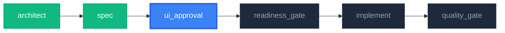

# UI Approval Gate (UI/ワイヤーフレーム承認ゲート)

> **核心原則**: 「実装前の視覚的確認」— コード作成前にUIを確認/承認し、手戻りを防止

SPEC文書とScreen文書を基にワイヤーフレームを生成し、ユーザー承認後にのみ実装フェーズへ進める品質ゲートです。

## 核心原則

1. **視覚的確認の保証**: 実装前に必ずUIワイヤーフレームを確認
2. **ユーザー承認必須**: 自動通過なし、明示的な承認が必要
3. **修正反復の制限**: 最大3回の修正後は強制決定を要求
4. **多層表現**: SVGダイアグラム + Mermaidフローチャート + ASCII UIレイアウト
5. **全機能必須**: すべてのパイプラインで実行(スキップ禁止)
6. **Before/After比較**: MODIFY_FEATURE時は現状との差分を明示

---

## ワークフロー

```
+-------------------------------------------------------------+
|                    UI Approval Gate                           |
+-------------------------------------------------------------+
|                                                               |
|  Phase 1: 情報収集 + コンテキスト把握                          |
|  +-- CONTEXT.json ロード                                       |
|  +-- SPEC.md ロード                                            |
|  +-- screens/*.md ロード                                       |
|  +-- [MODIFY] 既存UIコード読み込み (Before生成用)              |
|                                                               |
|  Phase 2: パイプライン進捗の可視化                              |
|  +-- 現在のパイプライン段階をSVGダイアグラムで表示              |
|  +-- 完了 / 現在位置 / 未着手を色分けで表現                     |
|                                                               |
|  Phase 3: ワイヤーフレーム生成                                  |
|  +-- SVGダイアグラム: ユーザーフローチャート (画面遷移)         |
|  +-- ASCII UI: 各画面のレイアウト                               |
|  +-- [MODIFY] Before/After比較レイアウト                       |
|  +-- 状態表示: ローディング / エラー / 空状態                  |
|                                                               |
|  Phase 4: ユーザーレビュー                                     |
|  +-- 「このように変更されます。承認しますか?」の形式で提示     |
|  +-- 承認 / 修正 / 拒否の選択を要求                             |
|                                                               |
|  Phase 5: 結果処理                                            |
|  +-- 承認 → CONTEXT.json更新 + 次段階へ進行                    |
|  +-- 修正 → フィードバック反映後Phase 3再実行 (最大3回)         |
|  +-- 拒否 → Fallbackルーティングオプション提示 (SPEC修正/デザイン再設計) |
|                                                               |
+-------------------------------------------------------------+
```

---

## プロトコル

### Phase 1: 情報収集

```markdown
## 情報収集

1. CONTEXT.json 確認
   - docs/features/<feature-id>/CONTEXT.json
   - current_state, why, success_criteria を確認
   - work_type (NEW_FEATURE / MODIFY_FEATURE) を判別

2. SPEC.md 確認
   - docs/features/<feature-id>/SPEC-\*.md
   - FR一覧、画面要件を確認

3. Screen文書確認
   - docs/features/<feature-id>/screens/\*.md
   - 画面別レイアウト、要素定義を確認

4. [MODIFY_FEATUREのみ] 既存UI読み込み
   - src/features/<feature-name>/components/のコードを読み込み
   - 現在の画面構造をBeforeレイアウトとして把握
```

### Phase 2: パイプライン進捗の可視化

**目的**: ユーザーが「今どの段階で、次に何が起こるのか」を一目で把握できるようにする

パイプライン全体の進捗をMermaidテキスト + ASCIIフォールバック形式のダイアグラムで表示します。

**進捗ダイアグラム形式**:



**出力テンプレート**:

```markdown
## パイプライン進捗

> **パイプライン**: {NEW_FEATURE | MODIFY_FEATURE}

{Mermaid/SVGダイアグラム}

|    段階          |   状態   |         スキル           |
| :-------------: | :------: | :--------------------: |
|    architect    |   完了   |   feature-architect    |
|      spec       |   完了   | feature-spec-generator |
| **ui_approval** | **現在** |  **ui-approval-gate**  |
| readiness_gate  |  未着手  |         (内蔵)         |
|    implement    |  未着手  |  feature-implementer   |
|  quality_gate   |  未着手  |    pre-quality-gate    |
```

### Phase 3: ワイヤーフレーム生成

AIがSPECとScreen文書を基に直接ワイヤーフレームを生成します。

#### 3A: ユーザーフローSVGダイアグラム

画面間のナビゲーションを**Mermaid flowchart**として生成。
beautiful-mermaidスキルが使用可能な場合はSVGレンダリングを実行します。

```markdown
### ユーザーフローチャート

{Mermaid flowchartダイアグラム}
```

**生成ルール**:

| 要素               | 表現                             |
| :----------------- | :------------------------------- |
| 画面               | 角丸ボックス `["画面名"]`           |
| ユーザーアクション        | 矢印ラベル `--\|アクション\|-->`      |
| 条件分岐          | ひし形 `{"条件"}`                |
| 外部API呼び出し      | 波型ボックス `[/"API名"/]`          |
| 状態変化          | 円形ボックス `(("状態"))`           |

#### 3B: ASCII UIレイアウト

各画面の構造をASCIIアートで表現。Terminal Noirデザインシステムに準拠。

**レイアウトルール**:

| 要素           | ASCII表現                    | Tailwind参照クラス                                            |
| :------------- | :---------------------------- | :-------------------------------------------------------------- |
| パネル           | `┌─ glass-panel ─┐ ... └───┘` | `backdrop-blur-xl bg-white/5 border border-white/10 rounded-xl` |
| ボタン           | `[ボタン名]`                    | `bg-blue-600 hover:bg-blue-700 rounded-lg`                      |
| 入力フィールド      | `[______入力______]`          | `bg-black/40 font-mono border-l-2 border-blue-500`              |
| アイコン         | `[Icon]`                      | Lucide/Heroicons SVG                                            |
| タブ             | `[Tab1] [Tab2] [Tab3]`        | `border-b-2 border-blue-500`                                    |
| プログレスバー  | `████████░░░░ 67%`            | `bg-blue-600 rounded-full`                                      |

**状態バリエーション**(各画面で以下を提示):

| 状態                  |                  必須                   |
| :-------------------- | :-------------------------------------: |
| 通常表示 (データあり) |                  必須                   |
| ローディング中               |                  必須                   |
| 空状態 (データなし)  |                  必須                   |
| エラー表示             | 任意 (エラーハンドリングFRがある場合)       |

#### 3C: Before/After比較 (MODIFY_FEATUREのみ)

既存機能を修正する場合、**現在のUI**と**変更後のUI**を並べて比較表示します。

**比較テンプレート**:

```markdown
### UI変更比較: {screen_name}

#### Before (現在)

{ASCII UI: 既存コードから読み取った現在のレイアウト}

#### After (変更後)

{ASCII UI: SPEC変更を反映した新レイアウト}

#### 変更サマリー

| 変更箇所  | Before       | After               | 理由          |
| :--------- | :----------- | :------------------ | :------------ |
| ヘッダー       | テキストのみ     | アイコン + テキスト     | 視認性向上   |
| カード配置  | 1列          | 2列グリッド          | 情報密度向上 |
| 新規追加  | -            | エクスポートボタン       | FR-00103対応 |
```

**Before読み取りルール**:

| 条件                            | Before生成方法                                                 |
| :------------------------------ | :--------------------------------------------------------------- |
| 既存コンポーネントあり              | `src/features/<name>/components/`のコードからASCII UIを生成       |
| コンポーネントなし (新規画面追加)  | Beforeは「なし(新規画面)」と明記し、Afterのみ表示                |
| ワイヤーフレーム既存               | `docs/wireframes/feature-<id>-wireframe.md`をBeforeとして使用      |

### Phase 4: ユーザーレビュー

生成されたワイヤーフレームをユーザーに**明示的な承認フロー**として提示する。

**核心提示形式** (NEW_FEATURE / MODIFY_FEATURE共通):
- ヘッダー: `# このように{実装|変更}されます。承認しますか?` + 機能ID + 作業タイプ + 修正回数
- 本文: パイプライン進捗 → ユーザーフロー → (NEW: 画面レイアウト + 状態バリエーション / MODIFY: Before/After比較 + 変更影響サマリー)
- フッター: 承認 / 修正要求 (残り回数明示) / 拒否 の3択

> NEW_FEATURE + MODIFY_FEATURE全体のレビューテンプレート: [review-templates.md](references/review-templates.md)

### Phase 5: 結果処理

3方向分岐で処理:

| 結果 | 核心アクション | CONTEXT.json変更 | 次段階 |
| :--- | :-------- | :---------------- | :-------- |
| **承認** | ワイヤーフレーム保存確定 + history記録 | `ui_approval.status="approved"`, `approved_at`, `revision_count` | feature-pilot Go信号 (実装進行) |
| **修正** | revision_count < 3 → Phase 3復帰 / >= 3 → 強制決定要求 | revisions[]にfeedback追加 | Phase 4再実行 |
| **拒否** | 明示的Fallback(逆方向ルーティング)オプション提示および理由記録 | `status="rejected"`, `rejected_reason`, `current_state="Blocked"` | ユーザー選択に応じてルーティング:<br>1) `feature-spec-updater`: 仕様/FR根本修正<br>2) `design-pilot`: デザインシステム/テーマ再設計<br>3) 即時再開始: フィードバックを反映してワイヤーフレームを0から再生成 |

> 詳細処理手順 / 強制決定 (3回修正後) テンプレート: [review-templates.md](references/review-templates.md), [state-management.md](references/state-management.md)

---

## SVGダイアグラム生成プロトコル

### beautiful-mermaid連携 (推奨)

beautiful-mermaidスキルが使用可能な場合、MermaidダイアグラムをSVG/PNGとしてレンダリングします。

**手順**:

1. Mermaidテキストでダイアグラムを生成
2. beautiful-mermaidスキルに渡してSVGレンダリング
3. SVGファイルを`docs/wireframes/`に保存
4. ワイヤーフレーム文書からSVGを参照

**ファイル命名規則**:

```
docs/wireframes/
├── feature-{id}-wireframe.md        # ワイヤーフレーム文書
├── feature-{id}-flow.svg            # ユーザーフローSVG
└── feature-{id}-pipeline.svg        # パイプライン進捗SVG
```

### フォールバック (beautiful-mermaid使用不可時)

beautiful-mermaidが使用不可の場合、以下で代替:

1. **Mermaidテキストブロック**: コードブロック内にMermaid記法を出力
2. **ASCIIフローチャート**: テキストベースの矢印で画面遷移を表現

```
[コード入力] ──→ [分析中...] ──→ [結果表示]
                                    ├──→ [説明パネル]
                                    ├──→ [Diff表示]
                                    └──→ [クイズ]
```

---

## CONTEXT.jsonスキーマ + 状態マシン

ui-approval-gate は CONTEXT.json に `ui_approval` セクションを追加/更新し、feature-pilot状態マシンに `UiApproval` 状態を追加する。

**核心フィールド** (`ui_approval`):
- `status`: `pending | in_review | approved | rejected`
- `wireframe_path`, `svg_paths.{flow,pipeline}` (生成された成果物のパス)
- `work_type`: `NEW_FEATURE | MODIFY_FEATURE`
- `revision_count` (≤3), `revisions[]` (フィードバック履歴), `approved_at`, `rejected_reason`

**状態マシン遷移の核心**: `SpecDrafting/SpecUpdating → UiApproval → Implementing` (承認時) / `→ Blocked` (拒否時) / `→ UiApproval` (Blocked解消時に再進入)。

> 全JSONスキーマ + 状態定義表 + 遷移ルール + ワイヤーフレームファイル命名規則: [state-management.md](references/state-management.md)

---

## 出力形式

3方向結果報告 (承認/修正/拒否) — ヘッダー + 核心フィールド + 次段階案内形式。

> 全報告テンプレート (承認/修正/拒否): [review-templates.md](references/review-templates.md)

---

## AI行動指針

### DO (すべきこと)

- **パイプライン進捗ダイアグラムを最初に表示**(現在位置の明確化)
- 生成したワイヤーフレームをユーザーに明確に提示
- **「このように変更されます。承認しますか?」の形式で提示**
- 承認/修正/拒否の明示的選択を要求
- 修正回数を正確に追跡 (最大3回)
- CONTEXT.jsonのui_approvalセクションを更新
- 承認/拒否結果をfeature-pilotに明確に伝達
- Terminal Noirデザインシステムに準拠したワイヤーフレーム生成
- **MODIFY_FEATURE時はBefore/After比較を必ず表示**
- **beautiful-mermaid使用可能時はSVGレンダリングを試行**
- **全状態バリエーション(通常/ローディング/空状態)を提示**

### DON'T (してはいけないこと)

- ユーザー承認なしの自動通過
- ワイヤーフレームなしの承認要求
- 3回を超える修正の許容
- 拒否理由の記録なしにパイプライン中断
- CONTEXT.json更新の漏れ
- **パイプライン進捗表示の省略**
- **MODIFY_FEATUREでのBefore/After比較省略**
- **すべての機能での必須実行 (スキップ禁止)**

---

## 使用例

### feature-pilotからの自動呼び出し (推奨)

```bash
# feature-pilotがSPEC生成後に自動で呼び出す
# すべての機能で必須実行
# ユーザーが直接呼び出す必要なし
```

### 直接呼び出し (単独使用)

```bash
# 特定機能のUIを事前確認したい場合
/ui-approval-gate dashboard

# 既存ワイヤーフレームの再レビュー
/ui-approval-gate dashboard --review
```

---

## 参照文書

- [CLAUDE.md デザインシステム](../../../CLAUDE.md) - Terminal Noirテーマ定義
- feature-pilotスキル - パイプライン統合
- feature-spec-generatorスキル - SPEC生成元
- beautiful-mermaidスキル - SVGレンダリング (使用可能時)

---

## Not For / Boundaries

このスキルは**UIワイヤーフレーム生成 + ユーザー承認ゲート**に限定される。以下は委譲対象である。

| 非対象領域 | 委譲対象 | 理由 |
| :---------- | :-------- | :--- |
| SPEC自体の作成 / FR定義 | `feature-spec-generator`, `feature-spec-updater` | 本スキルはSPEC入力を消費するのみで生成しない |
| 実際のUIコード実装 | `feature-implementer` | ワイヤーフレーム = 合意成果物、コード = 別段階 |
| デザイントークン / カラーシステム | `design-pilot`, `color-palette` | デザインシステム定義はdesign-pilot SSOT |
| Frontendポリッシュ / インタラクション | `feature-implementer`, `final-review` | 微細インタラクションは実装段階の責務 |
| E2Eテスト / 視覚回帰 | `e2e-runner` | 本スキルは静的ワイヤーフレームのみ扱う |
| Mermaid → SVG実レンダリング | `beautiful-mermaid` | 本スキルはMermaidテキストのみ生成、レンダリングは委譲 |
| Production UIコードレビュー | `design-pilot --review-only`, `final-review` | 実装後のレビューは別ゲート |
| A/Bテスト / ユーザーフィードバック測定 | `metrics-designer` | 仮説検証はメトリクス設計の責務 |

本スキルは**承認/拒否決定の永続化**までを行う。それ以降の段階は委譲対象の責務である。

---

## Maintenance

- **Sources**: brief2dev内部 (`.claude/rules/` R-CM/R-PL rules + `.claude/skills/` スキル規約)。外部referenceは本文参照。
- **Last updated**: 2026-05-05
- **Known limits**: 本スキルはワイヤーフレーム生成 + ユーザー承認ゲートのみ実行。実際のUI実装/デザイントークン/E2Eテスト/視覚回帰は上記「Not For / Boundaries」の委譲対象。
- **References**: [review-templates.md](references/review-templates.md), [state-management.md](references/state-management.md)
