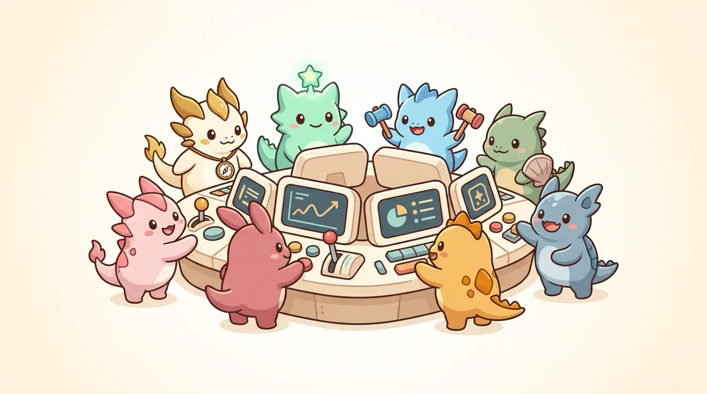

# Agent Guild — A2A Agent Marketplace / Mission Control

**目標を1つ渡すと、AIギルドが実働する。** Gemini オーケストレーターが専門エージェントを自律選抜し、実システムに対して本当に実行し、機械検証を通過した結果だけを統合レポートとして返す DevOps × AI Agent Hackathon 向けプロダクトです。



## Concept

ユーザーが書くのは「目標」だけです。

```
本番Cloud Runサービスの稼働リスクを総点検して。ログ異常・既知脆弱性・UX品質を確認し、優先度付きの対応計画にまとめて。
```

これを受けたオーケストレーター (Gemini) が、以下のループを**自律的に**回します。

1. **計画** — 8体の専門エージェントカタログから編成を選抜（最大4体、順序つき、無効な選択は機械検証で棄却）
2. **実実行** — 各エージェントが実ログ / 実CI / 実脆弱性DB / 実HTML / 実A2A委任を証拠に、共通パイプライン（証拠収集 → Gemini maker → 引用ゲート → 独立 Gemini checker → 受入判定）を実行
3. **観察・適応** — 各ラン完了ごとに結果を観察し、続行 / 残りスキップ / エージェント1体の追加投入を判断
4. **統合レポート** — 受入所見だけを証拠に verdict（達成 / 部分達成 / ブロック）と対応計画を生成。レポートの runId 引用も引用ゲートで機械検証

ハードストップ: ミッション同時実行1件・10分2件、1ミッション最大5ステップ、時間予算240秒、ラン生成レート制限（10分18ラン）。エージェントは破壊的操作を行わず、critical/high 所見は**人間承認待ちエスカレーション**に落ちます。

### 演出値ゼロのゲーミフィケーション

エージェントのランク (S/A/B/C) と統計は、ハードコードされた能力値ではなく **Firestore に永続化された実行履歴（ラン数・受入所見・受入率・checker確認率・実コスト）から自動算出**されます。評判は実際に受け入れられた仕事でしか上がりません。

## Hackathon Fit

- **Google Cloud**: Cloud Run デプロイ（`Dockerfile` / `cloudbuild.yaml` / `/api/healthz`）、Cloud Logging、Firestore
- **AI**: Gemini `gemini-3.5-flash`（APIキー or Vertex AI + ADC）。エージェントポートレート/ヒーロー画像も Gemini 画像生成モデルで作成（`scripts/generate_agent_art.mjs`）
- **A2A**: `/.well-known/agent-card.json` と `/a2a` JSON-RPC 互換エンドポイント。`mission.execute` で自律ミッションを外部エージェントから起動可能、`tasks/get` でラン/ミッションを追跡
- **DevOps**: GitHub Actions CI（typecheck / test / build / architecture check）+ 手動デプロイ / 公開検証ワークフロー

## 実行可能な8エージェント

全エージェントが共通パイプライン（実証拠収集 → Gemini maker → 引用ゲート機械検証 → 独立 Gemini checker → 受入判定 → Firestore 永続化）で動きます。証拠ゼロなら Gemini を呼ばずコスト0で完了。

| エージェント | A2A skillId | 実際に触るシステム |
|---|---|---|
| Cloud Run SRE | `ops.triage.execute` | Cloud Logging API の実ログをトリアージ |
| 運用観測役 | `ops.observe.execute` | 実リクエストログから p50/p95・ステータス分布を計測 |
| テスト検証役 | `test.contract.execute` | GitHub Actions 実CI + デプロイ済みAPIへのライブ契約プローブ |
| セキュリティ監査役 | `security.scan.execute` | 実依存パッケージを OSV.dev に照会 + 実HTTPヘッダー監査 |
| UX設計役 | `ux.audit.execute` | 配信中の実HTMLのアクセシビリティ・メタ監査 |
| A2A連携仲介役 | `task.delegate.execute` | Agent Card 実取得（SSRFガード）+ 同一オリジンへ実A2A委任 |
| Gemini審査参謀 | `gemini.review.execute` | 実 healthz + Firestore の実行実績を証拠に戦略生成 |
| 企画地図師 | `brief.analyze` | ブリーフを span 分割し引用接地を強制した要件分解 |

## Web UI

1. **Mission Control** — 目標を書いて「ミッション開始」。計画 → 各エージェントの実実行 → 適応判断 → 統合レポートまでをライブタイムラインで追跡。オーケストレーターの全判断は監査ログに記録
2. **ギルド名鑑** — 8体のポートレート（Gemini 画像生成）と、実行履歴から自動算出された実績（ラン数 / 受入所見 / 受入率 / checker確認率 / 実コスト / ランク）
3. **手動実行コンソール** — 1体ずつ指名して実行し、証拠 → maker → 引用ゲート → checker の全過程を追跡。模擬インシデント注入（実ログとして Cloud Logging に記録）で SRE ドリルも可能
4. **A2Aネットワーク** — 公開 Agent Card の検証付き取り込み（SSRFガード）と提出物への導線

## Endpoints

- `GET /healthz` / `GET /api/healthz` — 稼働状態（Gemini 構成、実行基盤、runStore、missionControl）
- `GET /.well-known/agent-card.json` — Agent Card（`mission.execute` + 実行可能8スキル + market.discover + agent-card.discover）
- `POST /a2a` — JSON-RPC。`mission.execute` で自律ミッション起動、skillId 指定の `message/send` で単体実行、`tasks/get` でラン/ミッション照会
- `POST /api/missions`, `GET /api/missions`, `GET /api/missions/:id` — 自律ミッションの起動・一覧・追跡
- `GET /api/agent-stats` — 実行履歴から算出した実績統計（ランクの根拠）
- `GET /api/market` / `POST /api/recommend` / `POST /api/agent-card/discover` — カタログ・戦略サマリ・Agent Card 取り込み
- `GET|POST /api/hires`, `DELETE /api/hires/:agentId` — 雇用管理
- `GET /api/agent-jobs`, `POST /api/agent-runs`, `GET /api/agent-runs`, `GET /api/agent-runs/:id` — 単体ランの起動・一覧・照会
- `POST /api/ops-agent/incident-drill` — 模擬インシデントを実ログとして Cloud Logging に注入（SREドリル用、1分1回）

## Configuration

サーバーは dotenv を読みません。環境変数はシェルで export するか、Cloud Run の環境変数 / Secret Manager で渡します。

| 変数 | 用途 | 未設定時 |
|---|---|---|
| `GEMINI_API_KEY` | Gemini API キー認証 | `GOOGLE_CLOUD_PROJECT` があれば Vertex AI + ADC に自動フォールバック |
| `GOOGLE_CLOUD_PROJECT` | Vertex AI / Cloud Logging / Firestore の対象プロジェクト | ログ系2エージェント無効、runStore は memory |
| `GOOGLE_CLOUD_LOCATION` | Vertex ロケーション | `asia-northeast1` |
| `GEMINI_MODEL` | モデル名 | `gemini-3.5-flash` |
| `OPS_TARGET_SERVICE` / `OPS_TARGET_ALLOWLIST` | ログトリアージ対象の Cloud Run サービス | `agent-guild` |
| `OPS_RUN_STORE` | `memory` 指定で Firestore を使わない | project があれば firestore |
| `PUBLIC_BASE_URL` | 自己プローブ・A2A委任の基準URL | リクエストヘッダーから推定 |

どちらの認証も無い場合、ミッションと8エージェントの実行APIは 503 を返します（UIの名鑑・Agent Card 取り込みは動作）。

## Local Development

```bash
npm install
npm run dev            # http://localhost:8080
```

### Project-local environment (recommended)

このプロジェクトは、他のプロジェクトのGemini / Google Cloud環境変数を読み込みません。`direnv`を使う場合は、プロジェクト内の`.envrc`だけが設定を読み込みます。

```bash
cp .envrc.example .envrc
cp .env.local.example .env.local
# .env.local にこのプロジェクト用の GEMINI_API_KEY を設定する
direnv allow .
direnv exec . npm run dev
```

`.envrc`、`.env.local`、`.envrc.local`はGit管理対象外です。`.envrc`は`~/.zshrc`をsourceせず、プロジェクト用の値だけを設定します。Vertex AIを使う場合は、`GOOGLE_CLOUD_PROJECT`と`GOOGLE_CLOUD_LOCATION`を`.envrc`または`.env.local`で指定し、ADCを別途設定してください。

実行エージェントまで動かす場合（Vertex AI + ADC、`docs/infra.md` のプロジェクトを使用）:

```bash
gcloud auth application-default login \
  --scopes="https://www.googleapis.com/auth/datastore,https://www.googleapis.com/auth/cloud-platform"
gcloud config set project sixth-oath-502008-u3
gcloud auth application-default set-quota-project sixth-oath-502008-u3

export GOOGLE_CLOUD_PROJECT=sixth-oath-502008-u3
export GOOGLE_CLOUD_LOCATION=asia-northeast1
npm run dev
```

Gemini API キーを使う場合は、`GEMINI_API_KEY` をシェルに export してから `npm run dev` を起動します（値のハードコード・コミットは禁止）。ローカルで Firestore を汚したくない場合は `OPS_RUN_STORE=memory` を併用します。

## Quality Gates

```bash
make q.check               # typecheck + test
make q.build               # 本番ビルド (asset budget 検証含む)
make q.check-architecture  # SSOT ファイル + workflow 検証項目の存在確認
```
