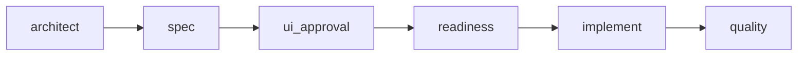
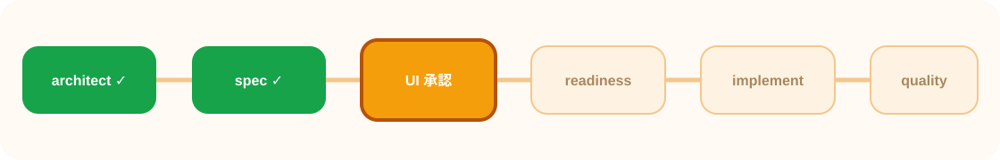
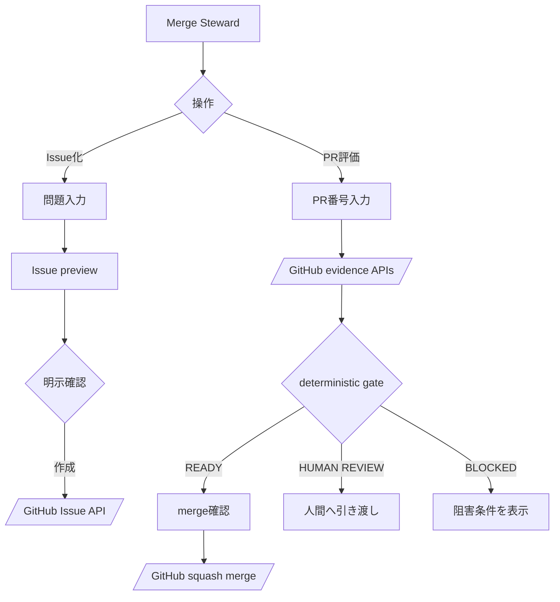
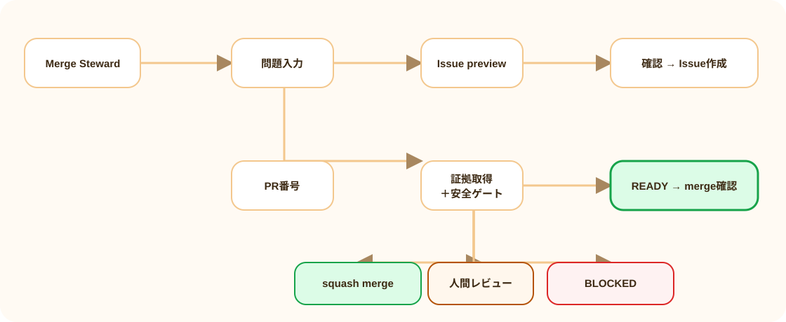

# こう実装されます。承認してください

> **Feature**: 022-merge-steward | **Work type**: NEW_FEATURE | **Revision**: 0/3

## パイプライン進行状況



| architect | spec | ui_approval | readiness | implement | quality |
|:---:|:---:|:---:|:---:|:---:|:---:|
| 完了 | 完了 | **現在** | 未着手 | 未着手 | 未着手 |



## ユーザーフロー





## 画面レイアウト

### 通常 / Success

```text
┌────────────────────────────────────────────────────────────┐
│ [守護者画像] Merge Steward        GitHub ● configured      │
│ Issue化から安全なマージまで。保護ルールは迂回しません。    │
│                                                            │
│ [ Issue化 ] [ PR評価 ]                                     │
├───────────────────────────┬────────────────────────────────┤
│ PR番号                    │ READY                           │
│ [ 55__________________ ]  │ checks     4 / 4                │
│                           │ approvals  1                    │
│ [変更を評価]              │ risk files 0                    │
│                           │ mergeable  yes                  │
│                           │ receipt     2e98…                │
├───────────────────────────┴────────────────────────────────┤
│ すべての安全ゲートを通過。head SHA: a34c20f                │
│                         [戻る] [squash mergeを確認]         │
└────────────────────────────────────────────────────────────┘
```

### Loading

```text
┌─ Merge Steward ────────────────────────────────────────────┐
│ GitHubの変更・CI・レビューを確認中…                        │
│ [████████░░░░] files → checks → reviews → gate             │
│ [変更を評価（無効）]                                       │
└────────────────────────────────────────────────────────────┘
```

### Empty

```text
┌─ Merge Steward ────────────────────────────────────────────┐
│ まだ評価はありません。                                     │
│ 問題をIssueにするか、既存PRの番号を入力してください。       │
│ [Issue入力例] [PR #55を試す]                               │
└────────────────────────────────────────────────────────────┘
```

### Partial / Error

```text
┌─ BLOCKED ──────────────────────────────────────────────────┐
│ checksは取得済みですが、review情報を確認できませんでした。 │
│ 取得できた証拠は保持し、merge APIは呼びません。            │
│ [再試行] [GitHubで確認]                                    │
└────────────────────────────────────────────────────────────┘
```

## 変更影響

| 場所 | Before | After | 理由 |
|---|---|---|---|
| 市場 | Merge Stewardなし | 新しいlegendary agentカード | lifecycle担当を発見可能にする |
| ホーム | GitHubはCI参照のみ | Issue/PR専用パネル | write actionを明示的に分離 |
| マージ | アプリから実行不可 | READYのみ確認付きsquash merge | フルサイクルを閉じる |

## 安全境界

- 書き込みは必ずpreview/evaluation後の明示確認。
- AIではなくdeterministic gateが最終可否を所有。
- 高リスクパス、失敗/保留check、競合、review不足、SHA変化ではmerge APIを呼ばない。
- GitHub tokenはブラウザへ送らない。

## 選択

- 承認: このレイアウトと安全境界で実装へ進む
- 修正: 最大3回まで具体的な変更点を反映
- 拒否: SPECまたは設計方針へ戻る
