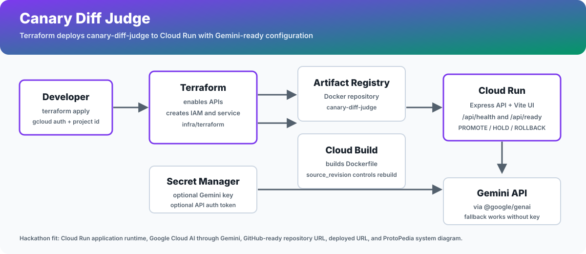

# Canary Diff Judge Terraform Deploy Guide

Compares revisions and decides promote, hold, or rollback.

## Verified Hackathon Target

The local hackathon source material requires a Google Cloud application runtime, Google Cloud AI technology, a public GitHub repository URL, a deployed project URL, and a ProtoPedia system architecture entry. This project maps those requirements as follows.

| Requirement | Implementation |
| --- | --- |
| Google Cloud application runtime | Cloud Run v2 service managed by `infra/terraform` |
| Google Cloud AI technology | Gemini API through `@google/genai`, with `GEMINI_MODEL` configured by Terraform |
| Deployable URL | Terraform output `service_url` |
| System architecture diagram | `docs/architecture.svg` |
| GitHub-ready source | README, Dockerfile, CI, security docs, and Terraform are in this project folder |

## Architecture



## What Terraform Provisions

- Google Cloud APIs: Cloud Run, Cloud Build, Artifact Registry, IAM, Secret Manager
- Artifact Registry Docker repository for the application image
- Cloud Build invocation that builds this repository's Dockerfile
- Cloud Run service with /api/health and /api/ready startup probe support
- Runtime service account with optional Secret Manager access
- Optional public invoker binding for hackathon judging

## Prerequisites

- Terraform 1.6 or newer
- Google Cloud SDK with `gcloud auth login` and `gcloud auth application-default login` completed
- A Google Cloud project with billing enabled
- Permission to enable APIs, run Cloud Build, create Artifact Registry repositories, create service accounts, and deploy Cloud Run

## First Deploy

```bash
cd outputs/03-canary-diff-judge/infra/terraform
terraform init
terraform apply \
  -var project_id="$GOOGLE_CLOUD_PROJECT" \
  -var source_revision="$(date +%Y%m%d%H%M%S)"
```

Terraform builds the container with Cloud Build, pushes it to Artifact Registry, and deploys the Cloud Run service. The hackathon submission URL is:

```bash
terraform output -raw service_url
```

## Gemini API Key

The app has a deterministic fallback for demos, but a Gemini-backed judging demo should attach a key. The recommended production path is to create the secret outside Terraform and pass the secret ID:

```bash
printf "%s" "$GEMINI_API_KEY" | gcloud secrets create canary-diff-judge-gemini-api-key \
  --project "$GOOGLE_CLOUD_PROJECT" \
  --replication-policy automatic \
  --data-file -

terraform apply \
  -var project_id="$GOOGLE_CLOUD_PROJECT" \
  -var existing_gemini_api_secret_id="canary-diff-judge-gemini-api-key" \
  -var require_gemini=true \
  -var source_revision="$(date +%Y%m%d%H%M%S)"
```

For a disposable demo environment, `-var gemini_api_key="$GEMINI_API_KEY"` also works, but Terraform state will contain the secret value.

## Smoke Verification

```bash
SERVICE_URL="$(terraform output -raw service_url)"
curl -fsS "$SERVICE_URL/api/health"
curl -fsS "$SERVICE_URL/api/ready"
curl -fsS "$SERVICE_URL/api/version"
```

Open `$SERVICE_URL`, run the sample scenario, and confirm a PROMOTE / HOLD / ROLLBACK decision is rendered.

## Redeploy After Code Changes

```bash
terraform apply \
  -var project_id="$GOOGLE_CLOUD_PROJECT" \
  -var source_revision="$(git rev-parse --short HEAD 2>/dev/null || date +%s)"
```

`source_revision` is part of the Terraform build trigger. Change it whenever you want Cloud Build to rebuild the same image tag.

## Lock Down After Judging

- Set `allow_unauthenticated_api=false` and provide `api_auth_token` for protected POST APIs.
- Set `cors_origin` to the final Cloud Run URL or your custom frontend origin.
- Set `allow_wildcard_cors=false` after `cors_origin` is specific.
- Set `require_gemini=true` once the Gemini secret is attached.
- Increase `deletion_protection=true` for long-lived deployments.

## Cleanup

```bash
terraform destroy -var project_id="$GOOGLE_CLOUD_PROJECT"
```
